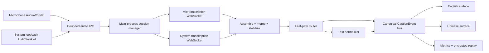

# Phase 0 and Phase 1 implementation plan

**Product:** Bilingual Meeting Captions

**Date:** 2026-07-29

**Source PRD:** [Bilingual Meeting Captions PRD](../specs/2026-07-29-bilingual-meeting-captions-prd.md)

**Foundation:** Sokuji v0.34.5 at
[`0808d3b7`](https://github.com/kizuna-ai-lab/sokuji/tree/0808d3b7aba613a5e58b97a6804e8730e706bd93)

**Initial validation platform:** macOS

**Final platform target:** macOS and Windows

## 1. Outcome

Phase 0 determines whether the screen-share overlay and cross-platform capture
premise are viable, then establishes a secure Sokuji-derived desktop
foundation. Phase 1 determines the transcription, normalization, routing,
latency, and cost configuration through a reusable A/B shell.

At the Phase 1 exit, the project is not yet the polished weekly-use product.
It is a working macOS technical prototype with:

- separate microphone and system-audio ingestion;
- live bilingual caption events;
- a primary and comparison pipeline;
- record/replay evaluation;
- measurable latency, language, quality, and cost results;
- a defensible decision on the Phase 2 production pipeline.

## 2. PRD review result

The revised PRD is ready to plan against. Its strongest change is the split
between Phase 0a kill-risk spikes and Phase 0b foundation work. Keep that
ordering.

The implementation must honor five review findings:

1. **Preserve Sokuji ancestry.** Start the implementation branch from the
   pinned Sokuji commit and reapply this repository's product documents. Do not
   import Sokuji with an unrelated-history merge or copy selected source files.
2. **Secure credentials before live API work.** Sokuji currently has renderer
   provider clients and API-key settings. Those are not an acceptable boundary
   for this product. Live OpenAI clients and secret decryption belong in
   Electron main.
3. **Do not rewrite the retained stack in Phase 0.** Sokuji already uses
   Electron, React, Vite, Electron Forge, Vitest, AudioWorklets, loopback
   capture, subtitle-window mechanics, and an eval runner. Retain those tools.
   A wholesale migration to another Electron starter would erase the benefit
   of using Sokuji.
4. **Treat the fast path as optional.** It may improve same-language latency,
   but the canonical dual-audience result cannot depend on a script heuristic.
   The Phase 1 shell must be able to disable it with one configuration switch.
5. **Separate provider facts from product assumptions.** Every price,
   parameter, retention behavior, and billing assumption in PRD §1.1 is a
   versioned verification record. Code must not silently encode an unverified
   value.

This is a single-developer project. The developer owns implementation and makes
each phase-gate decision from the recorded evidence; no separate approval
workflow is required.

## 3. Working architecture for Phases 0–1



Process ownership:

| Boundary | Owns | Must not own |
| --- | --- | --- |
| Renderer | device selection UI, AudioWorklets, subtitle rendering, review UI | API keys, provider clients, filesystem access |
| Preload | narrow validated functions and event subscriptions | raw `ipcRenderer`, provider credentials, business logic |
| Electron main | credentials, provider connections, session state, caption ordering, persistence, window coordination | visual rendering |
| Shared contracts | Zod schemas and TypeScript types for IPC, captions, evals, settings | runtime secrets or mutable state |

Use request/response IPC for controls and a bounded streaming channel for audio
and caption events. The bridge exposes named capabilities, never raw Electron
objects. Each incoming payload is runtime-validated.

## 4. Repository and change strategy

### 4.1 Establish the implementation lineage

The current repository contains only the PRD and supporting documentation. Use
that flexibility now:

1. Tag or otherwise record the current documentation commit as the product
   baseline.
2. Add `https://github.com/kizuna-ai-lab/sokuji.git` as the upstream remote.
3. Fetch the exact pinned commit.
4. Create `codex/phase-0-foundation` **from**
   `0808d3b7aba613a5e58b97a6804e8730e706bd93`.
5. Reapply the product documentation, `.gitignore`, and blank `.env.example`.
6. Record the upstream commit in a machine-readable file such as
   `UPSTREAM_SOKUJI.md` or `package.json` metadata.
7. Never merge newer upstream code wholesale. Pull later security or capture
   fixes as reviewed, traceable commits.

This produces a normal Sokuji ancestry with a small, reviewable product delta.

### 4.2 Change slices

Keep commits independently testable:

1. upstream lineage and product identity;
2. feature removal/disablement;
3. secure Electron boundary and credential store;
4. shared schemas and canonical event bus;
5. three-window mocked shell;
6. Phase 0 capture/spike harness;
7. transcription adapter;
8. assembly, merge, and stability;
9. normalization and routing candidates;
10. evaluation record/replay and metrics;
11. Phase 1 gate report.

Do not mix visual polish into provider or pipeline commits. Phase 0/1 surfaces
need to be readable and testable, but Phase 2 owns the final subtitle motion and
appearance.

## 5. Phase 0a — kill-risk spikes

Run these before provider integration.

### P0A-1: macOS overlay screen-share spike

**Build**

- Add a spike-only Electron entry or feature flag that opens two borderless
  solid test-card windows plus a small controller.
- Reuse Sokuji's `electron/subtitle-window.js` always-on-top enforcement.
- Give the two cards distinct solid colors and permanent `English` and `中文`
  labels.
- Add stacked and side-by-side placement commands.
- Log window level, bounds, display ID, Space/fullscreen state changes, and
  click-through state.

**Manual matrix**

| Meeting app | Normal window | Fullscreen call | Fullscreen presentation | Remote sees both |
| --- | :---: | :---: | :---: | :---: |
| Zoom | test | test | test | required |
| Microsoft Teams | test | test | test | required |
| Google Meet | test | test | test | required |

Run full-desktop sharing and verify from a separate remote participant device.
Capture screenshots from the remote view as the test evidence.

**Gate**

Pass only when both cards are visible remotely in all required scenarios.
Record exceptions by macOS version and meeting-app version. If a meeting app
cannot include overlays, stop and revise the delivery model before P0B work.

### P0A-2: Windows loopback spike

This remains an early kill-risk even though implementation begins on macOS.
Use a representative Windows 11 target machine and the pinned, unmodified
Sokuji capture path.

**Test**

- Capture microphone and system loopback as distinct files/level meters.
- Run once with a USB/Bluetooth headset and once with speakers.
- Test the actual meeting app and output device expected in service.
- Confirm device changes and reconnects do not collapse both channels into one.
- Record hardware, Windows build, audio driver, Electron version, and Sokuji
  commit.

**Gate**

Pass when the two streams are independently observable and correctly labeled.
If it fails, decide whether Phase 4 needs a native WASAPI loopback adapter,
virtual-device setup, or a revised Windows requirement before proceeding.

### P0A-3: echo and duplicate spike

Feed a known spoken sequence through system audio while recording the
microphone. Compare headset and speaker runs.

Measure:

- duplicate-caption candidates per 100 utterances;
- average cross-channel time offset for duplicates;
- whether Sokuji's retained capture path applies acoustic echo cancellation;
- whether a headset eliminates the practical problem.

The result supplies the initial duplicate-suppression window and determines
whether the product warning can remain a headset recommendation or must be a
hard start gate.

### Phase 0a evidence

Store non-sensitive results in:

```text
docs/validation/phase-0a/
  overlay-matrix.md
  windows-loopback.md
  echo-duplicates.md
```

Do not commit meeting audio or screenshots containing participant information.

## 6. Phase 0b — foundation import and slimming

### P0B-1: baseline and inventory

After establishing Sokuji ancestry:

- run the pinned test suite and capture the baseline failures;
- build and launch the macOS app unchanged;
- map retained modules and deletion candidates;
- produce `docs/architecture/sokuji-reuse-map.md` with a keep/replace/remove
  decision for each relevant subsystem.

Initial reuse map:

| Keep/adapt | Replace | Disable/remove from product |
| --- | --- | --- |
| `electron/main.js` lifecycle | provider/session orchestration | TTS and voice playback |
| `electron/subtitle-window.js` mechanics | one-window subtitle mode with a three-window manager | virtual microphone output |
| `src/lib/modern-audio/*` | renderer-owned live provider connections | user auth and hosted account flows |
| microphone/system device stores | renderer API-key settings | unrelated provider setup UI |
| React/Vite/Vitest/Forge | conversation model with `CaptionEvent` | local TTS/voice model UI |
| eval runner schemas/CLI | single-output eval cases | browser extension release path |

Prefer disabling an unrelated route before deleting deep dependencies. Remove
only after retained tests and packaging prove the code is not required.

### P0B-2: private product identity

- Change package name, product name, app ID, icons, update channel, repository
  metadata, and user-data directory.
- Remove Sokuji analytics and external auth startup paths.
- Disable automatic publishing and updates until a private release channel is
  selected.
- Keep AGPL license and required third-party notices.
- Add a single product feature configuration with:
  `captionsOnly`, `evaluationMode`, `comparisonPipeline`, and `fastPath`.

The working title may remain until the developer selects a final name, but
the bundle ID and user-data directory must not collide with Sokuji.

### P0B-3: secure Electron boundary

Create focused modules rather than growing `electron/main.js`:

```text
electron/
  captions/
    caption-session-manager.*
    caption-window-manager.*
  credentials/
    credential-store.*
  ipc/
    register-caption-handlers.*
    register-credential-handlers.*
src/shared/
  ipc/contracts.ts
  captions/schema.ts
  glossary/schema.ts
```

Required Electron security:

- `contextIsolation: true`;
- `sandbox: true`;
- `nodeIntegration: false`;
- strict Content Security Policy;
- deny unexpected navigation, new windows, permissions, and external schemes;
- validate sender and payload for every privileged IPC handler;
- expose only named preload functions;
- serialize errors as safe codes/messages rather than raw stack traces.

Use the existing Vite/Forge stack. Do not migrate the entire Electron main
process to a different build tool in this phase.

### P0B-4: credential store

Implement the packaged-app credential path described in
[`docs/security/api-key-setup.md`](../../security/api-key-setup.md):

- development source: ignored `.env.local`, read by Electron main only;
- packaged source: ciphertext protected by async `safeStorage`;
- provider-facing interface:
  `getCredential(provider)`, `setCredential(provider, value)`,
  `deleteCredential(provider)`, `getCredentialStatus(provider)`;
- IPC returns status only;
- logs redact authorization headers and known credential values.

Tests must prove a known fake key does not appear in renderer state, preload
surface snapshots, settings serialization, logs, exports, packaged renderer
assets, or IPC responses.

### P0B-5: canonical domain contracts

Implement the PRD `CaptionEvent`, `TargetText`, `Glossary`, session settings,
provider usage, and typed IPC schemas with runtime validation.

Rules:

- `sequence` is monotonic within a session;
- target revisions advance independently;
- final target text is immutable;
- aggregate status derives from target status;
- timestamps use monotonic time for latency and wall time only for display/logs;
- provider-specific fields remain inside provider metadata;
- the renderer consumes a language-specific projection and never chooses
  translation direction.

Add schema fixtures for:

- English source with Chinese pending;
- Chinese source with English pending;
- mixed-language source;
- one failed target;
- independently revised targets;
- final event with usage accounting.

### P0B-6: three-window mocked shell

Create one controller window and two caption windows coordinated by Electron
main. Use one renderer build with a validated surface parameter:

```text
control
caption?audience=en
caption?audience=zh
evaluation
```

The two caption windows:

- subscribe to the same canonical event bus;
- receive only their audience projection;
- render solid, labeled test bars;
- support stacked and side-by-side placement;
- restore safe bounds after display changes;
- stay out of the dock/taskbar where appropriate;
- do not receive settings or credentials they do not need.

For this phase, a mock-event generator is enough. Include mixed, pending,
revision, final, failure, reconnect, and burst scenarios.

### P0B-7: retained audio boundary

Retain Sokuji's microphone and loopback recorders, but make their output
provider-neutral:

- normalize each channel to mono 24 kHz PCM16;
- attach `sessionId`, `sourceChannel`, sequence, capture timestamp, and duration;
- batch audio into bounded chunks rather than one IPC call per sample frame;
- transfer buffers without stringifying PCM;
- apply explicit queue limits and report drops;
- expose independent level meters and device state.

The renderer captures audio because Web Audio APIs live there. Electron main
owns provider sessions. This is the only high-volume renderer-to-main path.

### P0B-8: claim, legal, and consent records

Create three gate records:

- `docs/decisions/provider-verification-2026-07-29.md`;
- `docs/decisions/agpl-distribution-scope.md`;
- `docs/policies/evaluation-recording-consent.md`.

The provider verification record includes source URL, accessed date, verifier,
exact model/endpoint/parameter, price unit, retention behavior, prompt-caching
behavior, and the code/config affected if the claim changes.

### P0B-9: automated verification

Add CI lanes that do not need live secrets:

- unit: schemas, reducers, credential redaction, window placement, queue limits;
- Electron security audit: webPreferences, preload surface, navigation/CSP;
- renderer build scan for fake secret sentinel;
- macOS build/package smoke;
- mocked three-window Playwright flow;
- upstream-retained test suite.

Do not put an API key into the ordinary build workflow.

### Phase 0 exit checklist

- [ ] Phase 0a overlay, Windows loopback, and echo decisions recorded.
- [ ] Implementation branch descends from pinned Sokuji commit.
- [ ] Retained baseline tests pass or accepted failures are documented.
- [ ] macOS mic and system audio are distinct provider-neutral PCM streams.
- [ ] Controller plus two caption windows render the same mock event.
- [ ] Stacked and side-by-side placement both work.
- [ ] Renderer and preload cannot read the OpenAI key.
- [ ] Every PRD §1.1 claim is verified or corrected.
- [ ] Cost tables are recalculated from verified prices.
- [ ] AGPL scope and recording consent decisions are documented.

## 7. Phase 1 — macOS technical validation and A/B shell

### P1-1: evaluation contracts and fixtures first

Extend Sokuji's eval runner before building adapters so every candidate targets
the same interface.

Define:

```ts
interface TranscriptionAdapter {
  start(config: TranscriptionConfig): Promise<void>;
  appendAudio(chunk: AudioChunk): Promise<void>;
  commitTurn(): Promise<void>;
  events(): AsyncIterable<TranscriptionEvent>;
  stop(): Promise<ProviderUsage>;
}

interface NormalizationAdapter {
  normalize(request: NormalizeRequest): Promise<NormalizedTarget>;
}

interface CaptionPipeline {
  run(inputs: TwoChannelInput, config: PipelineConfig):
    AsyncIterable<CaptionEvent>;
}
```

Add deterministic fakes for partial transcripts, reordered channels, duplicate
audio, reconnects, rate limits, semantic reversals, mixed scripts, and provider
failures. All orchestration tests run against fakes by default.

### P1-2: `gpt-live-transcribe` adapter

Create one main-process WebSocket session per source channel. Start from the
current official Realtime transcription contract and the verified PRD §1.1
record rather than Sokuji's voice-translation client.

Responsibilities:

- authenticate in Electron main;
- configure 24 kHz PCM and the selected turn-detection strategy;
- apply verified English/Chinese hints, glossary context, keywords, and delay
  profile only if supported by the live schema;
- send bounded Base64 audio chunks;
- preserve provider item IDs;
- emit typed delta, completed, error, usage, and connection events;
- reconnect with bounded exponential backoff;
- never replay already committed audio after reconnect;
- stop cleanly and close both sessions.

The adapter does not translate or render.

### P1-3: VAD-gated streaming experiment

Reuse Sokuji's VAD dependency initially. Maintain a short per-channel PCM
pre-roll ring buffer.

Compare:

1. continuous audio streaming;
2. open session with silence frames suppressed and approximately 300 ms
   pre-roll on speech onset.

Measure billed audio, first-syllable loss, onset latency, reconnect behavior,
turn segmentation, and accuracy. Do not close/reopen the WebSocket for ordinary
silence unless the provider contract requires it.

If billing is based on connection time rather than submitted audio, mark the
experiment failed and revise the launch cost gate; do not keep complexity that
does not save money.

### P1-4: utterance assembly and cross-channel ordering

Build pure, replayable stages:

1. provider delta assembler keyed by provider item ID;
2. turn finalizer;
3. cross-channel reorder buffer;
4. duplicate candidate detector;
5. stability buffer and provisional rate limiter;
6. canonical sequence allocator.

Every stage accepts timestamped events and produces typed events. Use a virtual
clock in tests. Keep reorder and stability windows configuration-driven so
replay can sweep them without another live API call.

### P1-5: script router and passthrough

Implement the cheap English/Chinese/mixed/unknown classifier for provisional
render routing only.

- English-like source may immediately populate the English target.
- Chinese-like source may immediately populate the Chinese target.
- mixed/unknown waits for normalization unless the current candidate explicitly
  enables mixed passthrough.
- final normalization remains authoritative.

Log heuristic versus final language classification and normalized text
divergence. The entire feature is disabled by `fastPath: false`.

### P1-6: normalization adapter and candidate profiles

Use a main-process text API adapter with strict structured output and
`store: false` where the selected endpoint supports it. Send only the current
utterance, bounded context, and selected glossary entries.

Candidate profiles:

| Candidate | Provisional | Final | Purpose |
| --- | --- | --- | --- |
| Economy | `gpt-5.4-nano` | `gpt-5.4-nano` | primary cost candidate |
| Tiered | `gpt-5.4-nano` | `gpt-5.6-luna` | likely quality/cost tradeoff |
| Quality ceiling | `gpt-5.6-luna` | `gpt-5.6-luna` | reference only |

All model names remain configuration values until verified. The adapter returns
one target language per call as specified by the revised PRD, allowing each
audience target to settle independently.

Implement:

- prompt/glossary serialization with a 400-token glossary budget;
- byte-identical stable prefix for prompt caching;
- provisional debouncing and per-target cancellation;
- maximum concurrent calls and calls-per-utterance;
- final-call priority over provisional work;
- retry rules that do not duplicate final captions;
- usage extraction and estimated cost;
- passthrough/failure output defined by PRD §10.5.

### P1-7: pipeline orchestrator and caption bus

Compose adapters through a session-scoped orchestrator owned by Electron main.

It must:

- start and stop both audio channels atomically;
- assign the active candidate and optional shadow candidate;
- broadcast one canonical event stream to both caption surfaces;
- prevent a slow shadow pipeline from delaying primary captions;
- terminate shadow work first at the budget cap;
- keep final caption ordering identical in both audience windows;
- expose health summaries, not credentials or raw provider payloads, to the
  control UI.

### P1-8: record/replay

Evaluation mode records:

- microphone PCM;
- system PCM;
- capture timing sidecar;
- provider events;
- pipeline configuration;
- committed caption events and provisional history;
- usage and cost.

Encrypt audio at rest with AES-256-GCM using a per-installation data key
protected by `safeStorage`. Use unique nonces, authenticated metadata, atomic
writes, and explicit format/version fields. Keep audio out of Git and default
retention to seven days.

Replay must preserve original chunk timing or run accelerated with a virtual
clock. Model-output replay must allow UI and metric changes without incurring a
new API call.

### P1-9: A/B shell

The evaluation surface is part of the product shell, not a throwaway script.

Controls:

- live versus replay input;
- primary and shadow candidate;
- delay/VAD/fast-path/glossary profiles;
- per-session budget cap, default $5;
- blinded candidate labels;
- start, stop, abort shadow, and export results.

Displays:

- synchronized source, English, and Chinese lines;
- final output first, provisional history on demand;
- per-stage latency waterfall;
- wrong-language and mixed-language flags;
- fast-path divergence;
- duplicate rate;
- token/audio usage and cost by stage/candidate;
- reconnect, drop, and backpressure events.

Exports a versioned JSON result and a concise Markdown decision report without
credentials or raw audio.

### P1-10: comparison adapters

Implement `gpt-realtime-translate` fan-out behind the same `CaptionPipeline`
interface. It runs only as a selected shadow benchmark because its four audio
streams have a materially higher expected cost.

Keep Soniox optional. Add it only if:

- its existing Sokuji adapter can be isolated without weakening the credential
  boundary;
- a valid evaluation key and terms are available;
- the OpenAI candidates do not already make the decision clear.

### P1-11: corpus and scoring

The screening corpus contains at least 200 consented or scripted utterances and
labels:

- source channel and authoritative source text;
- intended language class;
- English and Simplified Chinese reference meaning;
- engineering term/part-number annotations;
- code-switch boundary;
- critical wrong-language cases;
- speaker/accent/noise/headset conditions.

Score automated metrics and blinded human review separately. Automated metrics
screen candidates; bilingual human judgment decides semantic correctness and
terminology.

Run the smallest useful sequence:

1. deterministic unit/replay fixtures;
2. 200+ utterance screening corpus for all production candidates;
3. quality ceiling on a representative subset;
4. realtime-translate benchmark on the same subset;
5. gate corpus only for surviving candidates;
6. 60-minute live macOS soak for the winner.

Do not spend API budget on a candidate already eliminated by wrong-language,
critical terminology, or cost gates.

### P1-12: observability and budget controls

Track monotonic timestamps for:

- audio capture;
- chunk enqueue/send;
- first and final ASR text;
- merge release;
- provisional normalization request/response;
- first render per audience;
- final normalization request/response;
- final render.

Track provider-reported usage when available and a labeled estimate otherwise.
At 75% of the session cap, warn. At 100%, stop the shadow candidate first. If
the primary would exceed the cap, stop the session explicitly.

Use a dedicated OpenAI project with dashboard spend limits in addition to the
app's own estimate.

### P1-13: resilience and soak

Before the Phase 1 gate:

- simulate network loss and API errors in deterministic tests;
- switch microphone and output devices mid-session;
- sleep/wake the Mac;
- change displays and Spaces;
- reconnect after provider timeout;
- run 60 minutes with both audience surfaces open;
- confirm memory, queue depth, CPU, dropped audio, ordering, and spend remain
  bounded.

## 8. Evaluation decision table

The final report compares:

| Dimension | Economy | Tiered | Quality ceiling | Realtime translate |
| --- | --- | --- | --- | --- |
| Wrong audience language | measured | measured | measured | measured |
| Code-switch coherence | measured | measured | measured | measured |
| Engineering terminology | measured | measured | measured | measured |
| First readable caption latency | measured | measured | measured | measured |
| Final caption latency | measured | measured | measured | measured |
| Provisional reversal/flutter | measured | measured | measured | measured |
| Duplicate rate | measured | measured | measured | measured |
| Cost per 60 minutes | measured | measured | measured | measured |
| 60-minute reliability | measured | measured | subset | subset |

Apply the numeric gates in PRD §9. A candidate that misses critical
wrong-language or semantic-correctness gates is eliminated regardless of cost.
Among passing candidates, choose the lowest-cost configuration unless the
developer records why a measured quality difference is worth the premium.

## 9. Phase 1 exit artifacts

```text
docs/validation/phase-1/
  provider-contract-verification.md
  corpus-manifest.md
  latency-report.md
  quality-report.md
  cost-report.md
  vad-experiment.md
  fast-path-experiment.md
  soak-report.md
  architecture-decision.md
```

The architecture decision records:

- selected transcription and normalization models;
- delay, VAD, reorder, stability, glossary, and fast-path profiles;
- measured confidence and known limitations;
- per-hour and monthly cost at the expected usage cadence;
- rejected candidates and evidence;
- whether the $2.25 launch gate remains valid or moves to $2.40;
- explicit approval to begin Phase 2.

## 10. Definition of done

Phase 0 is done when kill risks are answered and the secure, mocked,
two-channel, three-window foundation meets every Phase 0 checklist item.

Phase 1 is done when one configuration meets the PRD prototype gates, survives
the macOS soak, and has a signed architecture decision backed by replayable
evidence. “The demo looked good” is not an exit condition.

## 11. Immediate execution order

1. Establish the Sokuji-descended implementation branch.
2. Run Phase 0a overlay, Windows loopback, and echo spikes.
3. Stop for the Phase 0a viability decision.
4. Complete the Phase 0b secure foundation and mocked shell.
5. Stop for the Phase 0b reuse/security decision.
6. Build the Phase 1 contracts and deterministic fakes.
7. Add live transcription, then assembly, then normalization.
8. Add record/replay, metrics, budget controls, and comparison adapters.
9. Run screening, gate, and soak evaluations.
10. Record the production pipeline decision before starting Phase 2 polish.
