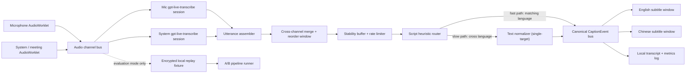

# Product Requirements Document: Bilingual Meeting Captions

**Status:** Approved for implementation

**Date:** 2026-07-29

**Revision:** 2026-07-29 (r2 — implementation review applied)

**Working title:** Bilingual Meeting Captions

**Distribution:** Private/internal

**Initial validation:** macOS

**Final supported platforms:** macOS and Windows

**Foundation:** Sokuji v0.34.5, pinned at commit
[`0808d3b7`](https://github.com/kizuna-ai-lab/sokuji/tree/0808d3b7aba613a5e58b97a6804e8730e706bd93)

**Ownership:** Single-developer project. The developer is the product owner and
makes each phase-gate decision directly from the recorded validation evidence.
There are no separate approval roles.

**Engineering capacity:** One developer. Phase durations are not commitments;
each phase ends on its exit criteria rather than a date.

## 1. Executive decision

Build a subtitle-only product on Sokuji's existing Electron foundation. Do not
rebuild audio capture, desktop packaging, session controls, or always-on-top
window behavior from scratch.

Use [`gpt-live-transcribe`](https://developers.openai.com/api/docs/models/gpt-live-transcribe)
as the primary transcription foundation. It is designed for low-latency
speech-to-text, accepts multiple expected-language hints, prompt context,
keywords, and a tunable delay, and currently costs $0.017 per audio minute.

Do **not** make the product depend on the transcription model choosing one
translation direction. Instead, every stabilized utterance must be normalized
into both audience languages:

```text
Any English, Mandarin, or mixed utterance
                ↓
       canonical caption event
        ↙                 ↘
English audience text   Chinese audience text
```

This is the key architectural decision. It eliminates the fragile assumption
that a bilingual speaker always has one source language and one target
language.

The primary candidate pipeline is:

1. Capture the microphone and meeting/system audio as separate channels.
2. Transcribe each channel with an independent `gpt-live-transcribe` session.
3. Assemble and stabilize transcript deltas by `item_id`.
4. Use a low-latency text model to detect English, Chinese, or mixed content
   and return both English and Simplified Chinese versions.
5. Publish one canonical caption event to two audience windows.

Start text translation evaluation with `gpt-5.4-nano` for speed and cost, and
A/B test it against a **tiered** configuration that uses `gpt-5.4-nano` for
provisional captions and `gpt-5.6-luna` for final captions only. Uniform
`gpt-5.6-luna` normalization is retained as a quality ceiling reference but is
not a viable production candidate on cost — see Section 12.1. Keep the
translation adapter model-independent so the result can change without
restructuring the app.

Confidence is high that this is the correct long-term architecture and the
lower-cost path. Confidence in exact code-switching latency and terminology
quality remains conditional until Phase 1 tests representative meeting audio.

### 1.1 Load-bearing claims requiring Phase 0 verification

Every model identifier, unit price, and capability claim in this document was
recorded from public documentation on 2026-07-29 and has **not** been
independently re-verified. Each must be confirmed against live provider
documentation at the start of Phase 0 and annotated with
`verified <YYYY-MM-DD> by <name>` in place.

| Claim | Where used | If wrong |
| --- | --- | --- |
| `gpt-live-transcribe` exists at $0.017/audio-minute | §6.2, §12.1 | Cost model and all gates in §9.1 must be rebuilt |
| It accepts multiple `languages` hints, `prompt`, `keywords`, and `delay` | §6.2 | Glossary and delay-profile design must change |
| It returns **no** detected-language label, word timestamps, or confidence | §6.4, §15 | Normalizer could be simplified; architecture still valid |
| `gpt-5.4-nano` at $0.20/$1.25 per 1M tokens | §12.1 | Primary pipeline may exceed the cost gate |
| `gpt-5.6-luna` at $1.00/$6.00 per 1M tokens | §12.1 | Tiering decision may change |
| `gpt-realtime-translate` at $0.034/audio-minute | §12.2 | Approach B viability changes |
| Prompt caching is available on the normalization endpoint | §12.1 | No candidate clears even the prototype cost gate |
| Transcription bills **streamed audio**, not connection wall-clock | §12.1.2 | VAD-gated streaming saves nothing; the $2.25 launch gate becomes unreachable |

The dual-output architecture in this section is deliberately robust to the
language-detection claim being wrong: producing both audience texts for every
utterance never requires a detected-language label. The **cost and latency
tables are not robust** to the pricing claims being wrong.

## 2. Problem

Engineering meetings include:

- a bilingual host who switches between English and Chinese;
- English-speaking coworkers;
- Chinese-speaking vendors;
- mechanical, manufacturing, timeline, and product-design terminology;
- measurements, tolerances, part numbers, acronyms, and product names.

Existing translation tools commonly model the session as one fixed source
language and one fixed target language. When the host switches languages, the
system may select the wrong direction or emit an unrelated language. This makes
the subtitles unreliable precisely when they are most needed.

The product must let everyone speak naturally while each audience reads the
entire conversation in its own language.

## 3. Product goals

### 3.1 Primary goals

- Transcribe English, Mandarin Chinese, and code-switched speech in realtime.
- Show every utterance in English in the English audience window.
- Show every utterance in Simplified Chinese in the Chinese audience window.
- Capture both the local microphone and remote meeting/system audio.
- Keep the two audio sources separate through the pipeline.
- Run on the same computer used to share the full desktop in a meeting.
- Provide two solid, always-on-top, independently controlled subtitle bars.
- Default to stacked lower-third bars.
- Offer side-by-side lower-third bars as a saved layout option.
- Avoid subtitle flutter, unstable reflow, and distracting motion.
- Preserve session transcripts and performance/cost logs locally.
- Include an A/B evaluation shell usable in real and replayed sessions.
- Validate on macOS first and ship Windows parity before final internal launch.

### 3.2 Non-goals

- Realtime voice generation or translated speech playback.
- Virtual microphones or audio routing into the meeting as generated speech.
- Voice cloning, TTS voices, or karaoke tied to generated audio.
- Mobile clients, browser extensions, or audience companion-device delivery.
- Speaker diarization within mixed remote meeting audio.
- A cloud account, multi-tenant backend, or public SaaS service.
- Supporting languages other than English and Simplified Chinese in v1.
- Editing or summarizing meeting content during the live session.

## 4. Target experience

### 4.1 Session setup

The user:

1. Opens the control window.
2. Selects a microphone and system/meeting audio source.
3. Connects a headset or earphones. Meeting audio played through speakers is
   captured by the microphone and produces duplicated captions on both
   channels; the control window warns when the selected output is not a
   headset. See Section 6.5.5.
4. Selects a layout: **Stacked** by default or **Side by side**.
5. Optionally selects an engineering glossary.
6. Starts captions.
7. Shares the full desktop in Zoom, Teams, Meet, or another meeting app.

The two subtitle windows remain visible above the meeting application. Sharing
only one application window may exclude the overlays; the product must explain
that full-desktop sharing is required.

### 4.2 During the meeting

- The English bar contains English only.
- The Chinese bar contains Simplified Chinese only.
- Each bar includes a persistent language label, so identity never relies on
  color alone.
- The current provisional line updates in place at a controlled rate.
- Once committed, a line never changes.
- A new committed line moves older lines upward with one short, calm motion.
- The subtitle bars have no controls while locked and can become click-through.
- Reconnection, delay, and unavailable states are visible but unobtrusive.

### 4.3 After the meeting

- The session is saved locally as a readable transcript and structured JSON.
- The log includes model configuration, timestamps, latency, revisions, errors,
  and estimated cost.
- The user may export or delete the session.
- Raw audio is not retained in normal mode.

## 5. Sokuji foundation

Sokuji already provides a cross-platform Electron/React application, microphone
and system-audio capture, cloud provider clients, subtitle mode, an
always-on-top window, session state, packaging, and an evaluation framework.
Its current stack includes Electron, React, TypeScript, Zustand, Vite, Vitest,
Electron Forge/builder, Web Audio, AudioWorklet, WebRTC, and WebSockets.

### 5.1 Keep with minimal change

| Sokuji capability | Decision | Reason |
| --- | --- | --- |
| Electron desktop shell | Keep | Proven macOS/Windows foundation |
| React + TypeScript + Zustand | Keep | Matches the current UI and state architecture |
| Microphone capture | Keep | Required local-speaker channel |
| System/participant audio capture | Keep | Required remote-participant channel |
| Web Audio and AudioWorklet pipeline | Keep | Suitable for realtime PCM handling |
| Device selection and session lifecycle | Keep | Avoid rebuilding operational controls |
| Always-on-top subtitle mechanics | Keep and extend | Includes platform-specific pinning and bounds handling |
| Settings persistence | Keep | Required for devices, layouts, colors, and glossary |
| Electron packaging/update configuration | Keep | Existing macOS and Windows paths |
| Vitest test suite | Keep | Existing unit/integration coverage |
| Evaluation runner and audio fixtures | Keep and extend | Strong base for repeatable A/B testing |

Relevant upstream implementations include the
[subtitle window controller](https://github.com/kizuna-ai-lab/sokuji/blob/0808d3b7aba613a5e58b97a6804e8730e706bd93/electron/subtitle-window.js),
[subtitle renderer](https://github.com/kizuna-ai-lab/sokuji/blob/0808d3b7aba613a5e58b97a6804e8730e706bd93/src/components/Subtitle/SubtitleStream.tsx),
and [evaluation framework](https://github.com/kizuna-ai-lab/sokuji/blob/0808d3b7aba613a5e58b97a6804e8730e706bd93/evals/README.md).

### 5.2 Adapt substantially

| Existing concept | Required adaptation |
| --- | --- |
| One subtitle surface | Create two audience windows plus one control window |
| Source/target language pair | Replace with English and Chinese audience outputs |
| Speaker/participant reverse direction | Replace with source channel independent of language |
| Provider client interface | Split into transcription and caption-normalization adapters |
| Conversation item | Replace/extend with canonical `CaptionEvent` |
| Subtitle store | Make the main/session process the synchronized source of truth |
| Provider settings | Add primary pipeline, comparison pipeline, glossary, and latency profile |
| Eval runner | Add bilingual routing, subtitle stability, latency, and cost metrics |

### 5.3 Remove or defer from the internal product

- Realtime TTS and translated audio playback.
- Voice selection and voice cloning.
- Virtual microphone and translated-audio routing.
- Local model download catalog.
- Browser extension.
- Non-evaluation providers.
- Public account, telemetry, and marketing flows.
- UI controls that exist only for audio generation.

Code may remain temporarily during the upstream import, but it must not shape
the new domain model or user experience.

### 5.4 Upstream strategy

- Begin from the pinned Sokuji commit rather than copying isolated snippets.
- Keep an `upstream` remote and preserve upstream history.
- Build caption-first features in new modules where practical.
- Avoid broad rewrites of reusable capture and packaging code.
- Record the upstream commit in every internal release.
- Treat AGPL and third-party notices as accepted project constraints.

**AGPL scope is a Phase 0 decision, not a deferred one.** Sokuji is AGPL-3.0.
Copyleft obligations attach on *distribution*, not on use. Running signed builds
on machines owned by a single legal entity is generally internal use. Handing a
signed build to a **vendor**, who is a separate legal entity, is plausibly
distribution and would trigger source-availability obligations for the combined
work.

Because Section 4.1 assumes vendors participate in these meetings, resolve
before Phase 0 exits:

1. Does the internal rollout ever place a build on a machine outside the
   entity? If yes, obtain written legal guidance before Phase 2 packaging.
2. If distribution is in scope, decide now whether the project accepts
   source-availability, because it constrains how much proprietary logic
   belongs in this repository versus a separately licensed service.

This determines whether the work can ever leave the building and therefore how
much investment is justified. The developer records the decision.

## 6. Technical architecture



The fast path exists so that the audience whose language is already being spoken
never waits on a model round trip. It is a rendering optimization only: the
final normalization at commit is still authoritative for both audiences, and the
heuristic never decides meaning. See Sections 6.5 and 9.1.

### 6.1 Process boundaries

**Electron main/session process**

- Owns window lifecycle and always-on-top behavior.
- Owns API credentials and OpenAI WebSocket sessions.
- Owns the canonical caption state and broadcasts updates.
- Owns logging, retention, export, and cost accounting.
- Validates all IPC payloads.

**Preload**

- Exposes narrow, typed functions through `contextBridge`.
- Never exposes raw `ipcRenderer`.

**Control renderer**

- Owns device selection, start/stop, layouts, glossary, and evaluation controls.
- Captures browser-accessible audio through the retained Sokuji audio services.
- Transfers audio buffers to the session process without exposing credentials.

**Subtitle renderers**

- Subscribe to filtered audience events.
- Contain no API credentials or provider logic.
- Render English or Chinese only.

Security defaults must include context isolation, sandboxing, disabled Node
integration, a strict CSP, argument validation, and OS-backed credential
storage.

### 6.2 Transport

Use WebSockets for `gpt-live-transcribe`. The application already has raw audio
channels and does not need a returned audio track. OpenAI's current guide
supports 24 kHz PCM input over WebSocket and emits transcript delta and
completion events.

Create one transcription session per active capture channel:

- `microphone`
- `system`

Configure:

- `languages: ["en", "zh-cn"]`
- `delay: "low"` as the initial profile
- a meeting-context `prompt`
- user-managed engineering `keywords`

The exact delay profile remains an A/B parameter. Test `minimal`, `low`, and
`medium` on real audio.

### 6.3 Canonical caption event

```ts
type TargetStatus = "pending" | "provisional" | "final" | "failed";

interface TargetText {
  text: string;
  status: TargetStatus;
  /** Incremented per target: EN and ZH revise independently. */
  revision: number;
  /** True when produced by fast-path passthrough rather than the model. */
  passthrough: boolean;
  firstRenderedAt?: number;
  finalizedAt?: number;
  /** Present when status is "failed". */
  error?: { code: string; message: string };
}

interface CaptionEvent {
  id: string;
  sessionId: string;
  /** Monotonic per session. Assigned after cross-channel merge; defines
   *  render order across both channels. See Section 6.5. */
  sequence: number;

  sourceChannel: "microphone" | "system";
  /** Provider-assigned item id, retained for assembly and debugging. */
  providerItemId: string;

  sourceText: string;
  sourceLanguage: "en" | "zh" | "mixed" | "unknown";
  /** Heuristic classification used for fast-path routing only. */
  routedAs: "en" | "zh" | "mixed" | "unknown";

  english: TargetText;
  chinese: TargetText;

  /** Aggregate: "final" only when both targets are final or failed. */
  status: "provisional" | "pending" | "final" | "failed";

  sourceStartedAt: number;
  sourceEndedAt?: number;
  firstTranscriptAt?: number;
  finalTranscriptAt?: number;

  glossaryId?: string;
  provider: {
    transcriptionModel: string;
    normalizationModel: string;
    /** Set when tiered normalization used a different model at commit. */
    finalNormalizationModel?: string;
    profile: string;
  };
  usage: {
    transcriptionAudioMs: number;
    normalizationTokensIn: number;
    normalizationTokensOut: number;
    normalizationCalls: number;
    estimatedCostUsd: number;
  };
}
```

The UI never decides translation direction. It selects `english` or `chinese`
from the same event.

Notes on the field set:

- `revision` is **per target** because the fast and slow paths advance
  independently. A single event-level revision counter cannot represent
  "English committed, Chinese still pending."
- `sequence` is assigned after the cross-channel merge, not at transcription
  time, because the two capture channels have independent latency.
- `usage` exists because Section 11.5 requires per-session token and cost
  accounting; deriving it after the fact from logs is not reliable.
- `sourceLanguage` is the normalizer's authoritative classification.
  `routedAs` is the cheap heuristic. Divergence between the two is a useful
  quality signal and must be logged.
- A `"failed"` target renders per Section 10.5 rather than rendering empty.

### 6.3.1 Glossary model

The glossary feeds two consumers with different needs: the transcription
session (`keywords`, to bias recognition) and the normalizer (term mapping, to
enforce consistent translation). One entry serves both.

```ts
interface GlossaryEntry {
  id: string;
  en: string;
  zh: string;
  /** Known misrecognitions and spoken variants, fed to ASR keywords. */
  aliases: string[];
  /** Part numbers, product names: emit verbatim in both audiences. */
  doNotTranslate: boolean;
  caseSensitive: boolean;
}

interface Glossary {
  id: string;
  name: string;
  entries: GlossaryEntry[];
}
```

Constraints:

- The transcription `keywords` list has a provider-imposed length cap
  (confirm the exact value per Section 1.1). When the glossary exceeds it,
  select entries by descending frequency in the current session, breaking ties
  by descending frequency in the historical corpus.
- The normalizer prompt carries the full term map, so glossary size directly
  drives input tokens on **every** normalization call. Set and enforce a token
  budget for the serialized glossary; see Section 12.1.
- `doNotTranslate` entries must survive verbatim into both audience texts and
  are exempt from the language-purity metric in Section 9.1.

### 6.4 Bilingual normalization

`gpt-live-transcribe` accepts multiple expected languages but does not return
detected-language predictions, word timestamps, speaker labels, or confidence
scores. The application therefore needs a small normalization stage.

The normalizer must:

- classify the utterance as English, Chinese, mixed, or unknown;
- return natural English and Simplified Chinese;
- preserve meaning without explanation or commentary;
- preserve measurements, tolerance signs, units, dates, quantities, part
  numbers, acronyms, file names, and product names;
- apply glossary terms consistently;
- copy same-language text with only necessary punctuation/format cleanup;
- translate mixed-language content into coherent versions for both audiences;
- return structured output validated against a schema.

Use a deterministic script heuristic as a fast hint, not as the sole decision:
Han characters strongly indicate Chinese; Latin-script engineering text
strongly indicates English. The model-normalized output is authoritative at
commit.

The heuristic has one concrete job beyond hinting: it selects which audience
bar can be served by the fast path (Section 6.5). Choosing the cheap path is a
reversible rendering decision; deciding meaning is not. If the final
normalization contradicts the heuristic, the final output wins, the divergence
is logged via `routedAs` versus `sourceLanguage`, and the affected line is
counted in the semantic reversal metric of Section 9.2.

**Adapter interface.** Keep the normalizer interface **single-target**:

```ts
normalize(input: {
  sourceText: string;
  target: "en" | "zh";
  glossary: Glossary;
  context: string;
  priorCommittedText?: string;
}): Promise<{ text: string; sourceLanguage: string; usage: Usage }>;
```

An implementation may batch both targets into one call, but the interface must
not assume it. A dual-output signature forecloses three things this design
needs: independent per-target revision, serving only the slow-path target,
and using different models per target.

### 6.4.1 Normalization candidates

| Candidate | Provisional captions | Final captions | Rationale |
| --- | --- | --- | --- |
| **Economy** | `gpt-5.4-nano` | `gpt-5.4-nano` | Lowest cost, lowest latency |
| **Tiered** _(expected production)_ | `gpt-5.4-nano` | `gpt-5.6-luna` | Quality where it is committed, logged, and exported; cost where it is transient |
| **Quality ceiling** _(reference only)_ | `gpt-5.6-luna` | `gpt-5.6-luna` | Establishes the upper bound on achievable quality. **Not a production candidate** — exceeds the cost gate by roughly 2× per Section 12.1 |

All candidates run with reasoning disabled.

The tiered candidate exists because provisional and final captions have
different requirements. A provisional line is overwritten within seconds and
needs speed. A final line is immutable, is what the audience actually retains,
and is what lands in the exported transcript — it justifies a better model at
roughly one-seventh the call volume.

### 6.5 Partial-text stability

Do not send every character delta through translation or directly to the UI.

- Assemble deltas by `item_id`.
- Preserve ordering explicitly because completion events may arrive out of
  order.
- Update source provisional text at most twice per second.
- Request a provisional normalization after punctuation, a short quiet period,
  or a meaningful token/character increment.
- Cancel or ignore stale normalization responses.
- On transcription completion, issue one final normalization per target.
- A committed caption is immutable.

The delay/stability buffer must be selectable in the evaluation shell. Initial
presets:

| Profile | Buffer intent |
| --- | --- |
| Fast | Lowest delay; more provisional revisions |
| Balanced | Default; calm captions with modest delay |
| Stable | Fewer revisions; accuracy prioritized |

### 6.5.1 Fast path and slow path

The audience whose language is currently being spoken must not wait on a model
round trip to see anything.

- When the script heuristic classifies an utterance as `en` or `zh`, the
  **matching** audience target is filled by passthrough: the assembled source
  text with punctuation and spacing cleanup applied locally, marked
  `passthrough: true`. No model call.
- The **opposite** audience target takes the slow path through the normalizer.
- When the heuristic returns `mixed` or `unknown`, both targets take the slow
  path and no passthrough occurs.
- At transcription completion, **both** targets receive a final normalization
  regardless of path. The passthrough text is provisional only; the model
  output is what commits. Passthrough exists to fill the reserved line during
  the round trip, not to replace normalization.

Consequences that the rest of the document depends on:

- Latency gates split by path — see Section 9.1.
- On the common monolingual utterance, model output tokens are roughly halved
  during the provisional phase.
- The `passthrough` flag must be recorded so that evaluation can measure how
  often passthrough text differed materially from the committed text.

### 6.5.2 Incremental normalization

Re-translating the entire growing utterance on every provisional tick wastes
tokens and inflates round-trip time as the turn lengthens.

- Track the last committed sentence boundary within the active utterance.
- Send only the text after that boundary as `sourceText`, passing the prior
  committed text as `priorCommittedText` for context.
- Concatenate the returned segment onto the already-rendered prefix.
- On final normalization, send the complete utterance once so the model can
  correct cross-boundary phrasing. This is the only full-utterance call.

### 6.5.3 Backpressure and call caps

Fast speech, a stuck stream, or an evaluation misconfiguration must not be able
to generate unbounded API calls.

- Cap normalization calls at a configured maximum per minute per channel.
  Initial value: 90.
- When the cap is reached, drop the oldest queued provisional request rather
  than queueing. Final normalizations are never dropped.
- At most one in-flight provisional normalization per target per utterance.
  A newer provisional supersedes and cancels the older.
- Emit a `delayed` state (Section 10.5) when provisional requests are being
  dropped for more than two consecutive seconds.

### 6.5.4 Cross-channel ordering

The microphone and system channels run as independent transcription sessions
with independent latency. Ordering within a session by `item_id` is necessary
but not sufficient — near-simultaneous speech on the two channels will
otherwise render in the wrong conversational order.

- Assign `sequence` after a bounded reorder window keyed on `sourceStartedAt`.
- Initial reorder window: 400 ms. It is an evaluation parameter.
- Events arriving after their window has closed append in arrival order and
  increment the out-of-order correction counter in Section 9.2.
- The window applies to **commit** ordering only. Provisional text renders
  immediately in its own bar and is never held for reordering.

### 6.5.5 Echo and duplicate suppression

If meeting audio is played through speakers, the microphone captures it, and
the same speech is transcribed on both channels — producing duplicated captions
attributed to the wrong source.

- **Baseline requirement:** the setup flow (Section 4.1) states that a headset
  or earphones are required for correct behavior, and the control window warns
  when the selected output device is not a headset.
- Retain any platform acoustic echo cancellation available in the Sokuji
  capture path; verify during the Phase 0 audio spike whether it is active.
- Add duplicate suppression as a safety net: when two utterances on different
  channels overlap in time and exceed a normalized-text similarity threshold,
  suppress the microphone-channel copy and record the suppression.
- Duplicate rate is a Phase 1 measured metric, not an assumption.

## 7. Model approaches and A/B decision

### 7.1 Approach A — transcription plus dual text normalization

**Recommended production foundation**

- Two `gpt-live-transcribe` sessions, one per audio channel.
- One shared text-normalization adapter.
- Native glossary and structured output.
- Produces both audience texts from every utterance.
- Lowest expected recurring cost.
- Best separation of concerns and easiest model replacement.

Primary risk: the app must implement stabilization and bilingual normalization
because the transcription stream does not provide detected-language labels.

### 7.2 Approach B — realtime translation fan-out

- Feed each audio channel to one `gpt-realtime-translate` session per target
  audience language.
- Discard/mute generated audio and retain transcript deltas only.
- Four continuous translation sessions for two sources and two targets.

Advantages:

- Direct streaming speech translation.
- Useful latency and quality comparison.

Disadvantages:

- Approximately four times the audio-session cost of Approach A.
- Returns audio the product does not need.
- Fixed target language per session.
- Less control over glossary and output schema.
- Same-language and mixed-language behavior must be verified.

This is a benchmark and fallback, not the initial foundation.

### 7.3 Approach C — Sokuji Soniox two-way

Sokuji currently exposes Soniox two-way translation with automatic language
detection. Retain it only as an optional external baseline if credentials are
available. It must pass the same privacy, cost, language-purity, terminology,
and latency gates before consideration.

### 7.4 Decision rule

Choose Approach A unless another pipeline:

1. improves bilingual human-rated semantic accuracy by at least 0.3 on a
   five-point scale, where the difference is significant at the 95% level given
   the corpus size and measured inter-rater agreement **or** improves
   cross-language caption p95 latency by at least 500 ms;
2. still meets all critical entity-preservation and reliability gates; and
3. has an accepted recurring cost.

**Tiebreak when a candidate wins one axis and loses the other.** This is the
likely outcome for Approach B, which should be faster and more expensive. Apply
in order:

1. Any candidate failing a critical-entity or reliability gate is eliminated,
   regardless of latency. Meaning errors in an engineering meeting are more
   costly than delay.
2. Any candidate exceeding the cost gate in Section 9.1 is eliminated.
3. Among survivors, prefer semantic accuracy over latency while
   cross-language p95 remains within gate. Prefer latency only once accuracy
   differences are inside the confidence interval.

**Rating methodology.** Semantic accuracy is rated by at least two bilingual
raters on blinded, shuffled output. Report inter-rater agreement; if agreement
is poor, the accuracy comparison is not decisive and the tiebreak above falls
through to cost and latency. State N and the confidence interval alongside every
reported mean — a 0.3-point difference on a small corpus is frequently noise.

Within Approach A, evaluate the three candidates in Section 6.4.1. Choose the
Economy candidate unless the Tiered candidate produces a material, repeatable
quality improvement on the engineering corpus. The Quality-ceiling candidate is
measured for reference only and is not selectable for production.

## 8. Evaluation shell

The evaluation capability is part of the product shell, not a throwaway script.

### 8.1 Live session controls

- Pipeline profile selector.
- Transcription delay selector.
- Normalization model selector, including the tiered configuration in
  Section 6.4.1.
- Fast-path routing toggle, so passthrough can be disabled for comparison.
- Stability profile, provisional cadence, and reorder-window controls.
- Glossary selector, with serialized token count displayed.
- Optional comparison/shadow pipeline.
- Visible running cost estimate.
- Session budget cap with soft warning, per Section 12.1.5.
- Per-channel connection and audio activity status.
- Marker button for noting a bad caption during a meeting.

Shadow mode is off by default because it increases API cost.

### 8.2 Record and replay

Normal sessions never save raw audio. Evaluation mode may record both channels
only after explicit activation.

Replay must:

- preserve microphone and system tracks separately;
- feed identical audio to every candidate;
- preserve real-time chunk timing or run accelerated offline;
- save model configuration and version;
- make runs reproducible.

Evaluation audio should be encrypted locally and deleted after its configured
retention period.

### 8.3 Review interface

After a run, show synchronized utterances with:

- source transcript;
- English output from each candidate;
- Chinese output from each candidate;
- last provisional text alongside the committed text, so semantic reversals
  (Section 9.1.3) can be rated;
- per-stage latency against the budget in Section 9.1.2, not only end-to-end,
  so a gate miss is attributable to a stage;
- fast-path versus slow-path attribution per target;
- per-target revision count;
- estimated cost, broken out by transcription and normalization;
- error/reconnect events and normalization failures by cause;
- blinded A/B preference and 1–5 ratings;
- inter-rater agreement across raters, per Section 7.4;
- flags for wrong language, omission, hallucination, number/unit error, and
  terminology error.

### 8.4 Representative corpus

**Sizing.** The rate-based gates in Section 9.1 cannot be resolved at 200
utterances: distinguishing 99.0% from 99.5% requires far more samples than the
one or two failures such a corpus permits, and ~50 critical-entity utterances
cannot separate 98% from 99% at all. Two corpus tiers are therefore defined:

| Tier | Size | Purpose |
| --- | ---: | --- |
| **Screening corpus** | 200+ utterances | Phase 1 candidate elimination. Sufficient to detect gross failures — wrong audience language, systematic terminology corruption, code-switch collapse. |
| **Gate corpus** | 1,000+ utterances, 250+ with critical entities | Required before any rate-based gate in Section 9.1 is declared passed. |

Rate-based gates evaluated against the screening corpus must be reported as
"no observed failures, 95% CI upper bound X%" rather than as a passed
percentage. Do not report a 99.5% pass on 200 samples.

**Collection is a scheduled dependency, not an assumption.** Building the
corpus requires recording real meetings, which requires the encrypted
record/replay stack from Section 8.2 to already exist, and requires consent
from every participant including vendors. Some jurisdictions require all-party
consent for recording. Therefore:

- Corpus collection runs as a parallel track beginning in Phase 0, not as a
  Phase 1 deliverable that assumes the corpus exists.
- A written recording-consent policy, covering vendors and external
  participants and naming the applicable jurisdictions, is a Phase 0 exit
  criterion.
- Where consent is unavailable, substitute scripted read-aloud sessions using
  real terminology. Record which portion of the corpus is scripted rather than
  spontaneous; scripted speech understates the difficulty of the real task.

The corpus must contain at least 200 utterances covering:

- English-only engineering speech;
- Mandarin-only engineering speech;
- code-switching between sentences;
- code-switching within one utterance;
- numbers, dates, dimensions, tolerances, currency, percentages, and deadlines;
- part numbers, acronyms, product names, and proper nouns;
- local microphone and meeting-compressed system audio;
- fast speech, accents, pauses, background noise, and limited overlap.

At least 25% of the corpus must contain code-switching, and at least 50
utterances must contain critical numbers, units, or identifiers.

## 9. Evaluation criteria and quality gates

### 9.1 Core metrics

| Dimension | Prototype gate | Pilot/launch gate |
| --- | ---: | ---: |
| Audience language purity | ≥99.0% | ≥99.5% |
| Critical numbers/units/IDs preserved | ≥98.0% | ≥99.0% |
| Human semantic accuracy | ≥4.0/5 | ≥4.2/5 |
| Hallucination or material omission | <2.0% | <1.0% |
| First source partial, p50 | ≤0.8 s | ≤0.7 s |
| First source partial, p95 | ≤1.8 s | ≤1.5 s |
| **Same-language caption** (fast path), p50 | ≤1.0 s | ≤0.9 s |
| **Same-language caption** (fast path), p95 | ≤2.0 s | ≤1.7 s |
| **Cross-language caption** (slow path), p50 | ≤1.8 s | ≤1.6 s |
| **Cross-language caption** (slow path), p95 | ≤3.4 s | ≤3.0 s |
| Final stable caption after speech end, p95 | ≤3.5 s | ≤3.0 s |
| Semantic reversal, last provisional → final | <3.0% | <1.5% |
| 60-minute session completion | No crash | No crash or unrecovered stream |
| Automatic reconnect | ≤8 s | ≤5 s |
| Primary pipeline cost, 60 minutes | ≤$2.50 | ≤$2.25 † |

† The launch cost gate is **conditional**. Per Section 12.1.2, audio alone is
$2.04, leaving ~$0.21/hour for normalization, which no text-side configuration
achieves. $2.25 is reachable only if VAD-gated audio streaming works. If it
does not, the launch gate moves to $2.40 as a documented decision. See
Section 16.5.

Thresholds are initial product targets and may be recalibrated once Phase 1
establishes measurement noise; changes require a documented decision.

Three changes from the original gate set, each explained below: latency is
split by path, the committed-revision gate is replaced, and the measurement
procedures are specified.

#### 9.1.1 Why latency splits by path

The original single gate of 3.0 s p95 for a translated caption did not close
against its own 1.8 s p95 for the first source partial. That leaves 1.2 s for
the stability hold, the normalizer round trip, IPC, and paint — and serial
dependent stages have a worse combined tail than a naive sum of p95s suggests.

Section 6.5.1 splits rendering so that the matching-language bar needs no model
call. The gates follow that split. The cross-language p95 is also relaxed from
3.0 s to 3.4 s at prototype, because that figure is achievable and the original
was not; the launch gate holds at 3.0 s and is the target the tiered
normalization and incremental translation work is meant to reach.

#### 9.1.2 Latency budget decomposition

A missed end-to-end gate must identify which stage caused it. Budget for the
cross-language p95 path at launch (3.0 s):

| Stage | Budget (p95) | Measured how |
| --- | ---: | --- |
| Speech onset → first ASR partial received | 1.50 s | Offline VAD onset to WebSocket delta timestamp |
| Stability buffer hold before normalization fires | 0.45 s | Assembler emit → normalizer request sent |
| Normalizer round trip | 0.90 s | Request sent → response validated |
| Merge, IPC, and paint | 0.15 s | Response validated → renderer frame committed |
| **Total** | **3.00 s** | |

Each stage is instrumented and reported independently in the evaluation review
interface. A candidate that misses the total gate must report which stage
exceeded its budget.

#### 9.1.3 Measurement procedures

**Latency clock origin.** Latency clocks begin at speech onset as determined by
a **fixed offline VAD run over the recorded fixture**, not by the live pipeline's
own detection. Using each candidate's own detector would make candidates
incomparable. The VAD configuration is versioned with the corpus and is not a
tunable parameter of any candidate.

**Audience language purity.** Measured per utterance over tokens, excluding a
declared allowlist. A Chinese caption containing `M3×0.5`, `PVT`, `SolidWorks`,
or a part number is **correct**, and a naive script-ratio metric would score it
as impure. Excluded from the denominator:

- glossary entries flagged `doNotTranslate`;
- numerals, units, and measurement expressions;
- acronyms, part numbers, file names, and product names as annotated in the
  corpus gold labels.

An utterance passes when every non-excluded token is in the audience language.
The metric is the fraction of utterances passing.

**Critical entity preservation.** The corpus carries gold annotations marking
each critical entity — number, unit, tolerance, date, quantity, part number,
acronym, identifier — with its expected surface form in each audience language.
An entity is preserved when it appears in the committed caption in an accepted
form. The accepted-form list per entity is part of the corpus, not decided at
scoring time. Scoring is automated against those annotations; only ambiguous
cases go to human adjudication.

**Semantic reversal** replaces the original "committed-line revisions = 0"
gate, which was tautological: Section 6.5 defines committed lines as immutable,
so that gate was satisfied by construction and measured nothing. What matters
is whether the reader saw provisional text whose meaning the final text then
contradicted. An utterance counts as a reversal when the last rendered
provisional text and the committed text differ in meaning — negation, a changed
number or identifier, a changed subject, or a changed action — as opposed to
differing only in phrasing, punctuation, or completeness. Rated by the same
blinded human process as semantic accuracy.

**Cost.** Measured from the `usage` fields on `CaptionEvent` accumulated across
a session, not estimated from wall-clock time. Reported per 60 minutes of
session wall clock, including idle periods, because that is what the user pays.

### 9.2 Subtitle stability metrics

- Provisional render frequency.
- Characters replaced per revision.
- Provisional-to-final character churn per utterance.
- Number of full-line replacements.
- Time between final source transcript and final audience text.
- Out-of-order event corrections, and events arriving after their reorder
  window closed (Section 6.5.4).
- Lines dropped or truncated.
- Provisional normalization requests dropped by backpressure (Section 6.5.3).
- Fast-path passthrough rate, and how often passthrough text differed
  materially from the committed text.
- Heuristic divergence: `routedAs` not matching final `sourceLanguage`.
- Cross-channel duplicate suppressions (Section 6.5.5).
- Normalization failures by cause, and time spent in the failed render state.
- UI main-thread frame time during caption motion.

### 9.3 Manual meeting checklist

- Full-desktop screen share includes both bars.
- Zoom, Teams, and Meet do not cover the bars.
- The bars remain above fullscreen and presentation windows where supported.
- Both bars are readable against bright, dark, and visually busy content.
- Locked bars do not capture accidental clicks.
- Device changes, sleep/wake, headphones, and meeting-app restarts recover.
- A 60-minute session does not drift, leak memory, or progressively lag.

## 10. Subtitle UI requirements

### 10.1 Window model

- One control window.
- One English subtitle `BrowserWindow`.
- One Chinese subtitle `BrowserWindow`.
- Borderless and always-on-top.
- Independently draggable, resizable, lockable, hideable, and restorable.
- Click-through while locked.
- Positions and sizes persist by display configuration.
- Re-clamp windows when displays are disconnected or resolution changes.

### 10.2 Layouts

**Stacked lower thirds — default**

- English and Chinese bars share one lower-third reading zone.
- Bars are vertically adjacent with a small, fixed gap.
- Order is configurable and persisted.
- Best for one shared screen and consistent eye position.

**Side-by-side lower thirds — option**

- English and Chinese bars split the lower-third width.
- Each window gets equal width by default.
- The divider gap remains visible.
- Automatically falls back to stacked when the display is too narrow for the
  selected minimum text measure.

The user can save custom positions after unlocking the bars.

### 10.3 Visual system

- Fully solid backgrounds; no translucency, backdrop blur, or glass effect.
- Default English surface: deep navy `#0B3B66`, white text.
- Default Chinese surface: deep burgundy `#7B2431`, white text.
- Each bar displays `ENGLISH` or `中文`.
- Colors are editable through semantic theme tokens.
- Every foreground/background pair must meet WCAG AA contrast; target AAA for
  primary subtitle text.
- Use platform system fonts:
  - macOS: SF Pro/PingFang SC fallbacks;
  - Windows: Segoe UI/Microsoft YaHei fallbacks.
- Text size is adjustable, initially 20–48 px.
- Prefer wrapping; never truncate active captions.
- Use a maximum of two visible caption lines per language by default.

#### 10.3.1 Overflow behavior — open decision

"Never truncate" and "maximum two visible lines" conflict as soon as an
utterance needs a third line, which is routine for English at larger text
sizes. This must be resolved before the renderer is built; it determines
whether the subtitle surface can change size during speech, which Section 10.4
otherwise forbids.

The three viable resolutions:

| Option | Behavior | Cost |
| --- | --- | --- |
| **A. Fixed height, scroll within** | Bar height is constant. A third line pushes the first line out of view early. | Reader may miss the start of a long sentence |
| **B. Fixed height, auto-fit text** | Font size steps down to fit two lines. | Text size changes mid-utterance; readability varies |
| **C. Bar grows** | Bar height expands to fit, anchored at its bottom edge. | The solid surface animates during speech, contradicting §10.4 |

**Recommendation: A**, with the reserved line count raised to three at text
sizes above 32 px. It is the only option that keeps both the surface and the
text metrics stable, and stability is the stated priority of the whole visual
system.

**Owner and deadline:** decide before Phase 2 renderer work begins.

#### 10.3.2 Length asymmetry between the bars

Simplified Chinese runs roughly 40–60% of the character count of equivalent
English. The two bars will routinely need different heights for the same
utterance. The stacked layout must therefore:

- anchor both bars to the bottom of the lower-third zone;
- keep the inter-bar gap fixed and let the stack grow upward;
- size each bar independently rather than forcing a shared height, which would
  leave large empty regions in the Chinese bar.

Under overflow option A this produces no motion during speech, because each
bar's height is a function of the configured text size and reserved line count
rather than of content.

### 10.4 Motion

The desired Apple Music-like quality applies to line movement, not word-level
karaoke. `gpt-live-transcribe` does not provide word timestamps.

- Provisional text updates in the same reserved line.
- Do not animate every token or character.
- On commit, older lines translate upward once over 160–220 ms.
- Use a strong ease-out or critically damped no-bounce motion.
- Animate only `transform` and, where useful, a brief text crossfade.
- Never animate the solid subtitle surface itself during normal speech.
- Never use bounce.
- Motion must be interruptible and must not block input.
- Under reduced motion, replace line travel with an immediate update or short
  crossfade.

The motion exists only to explain spatial continuity and prevent a jarring
line jump. It must remain calm after an hour of continuous use.

### 10.5 States

- Listening.
- Speech detected.
- Translating.
- Reconnecting.
- Delayed.
- Audio source unavailable.
- API unavailable or quota exceeded.
- Session stopped.

Status must not replace or obscure an active caption. Errors must state the
cause and a recovery action in the control window.

#### 10.5.1 Pending translation

While a cross-language caption is on the slow path, the opposite bar has no
text for it. Half the audience would otherwise watch a frozen bar while the
other half reads live text.

- The waiting bar shows a low-contrast pulse on the reserved line that will
  receive the text — a placeholder occupying the line, not a spinner.
- The pulse must not change the bar's height or position.
- It appears only after 400 ms of waiting, so that fast responses produce no
  visible placeholder at all.
- Under reduced motion, the placeholder is static rather than pulsing.

#### 10.5.2 Normalization failure

Schema validation failure, timeout, quota exhaustion, and connection loss will
occur in normal weekly use. They are a defined product state, not an exception
path.

- The bar whose language matches the source shows the passthrough source text,
  which is already available and requires no model call.
- The opposite bar shows a persistent inline marker reading
  `translation unavailable` / `翻译不可用` on the line that would have carried
  the caption.
- The line commits in that state and, like any committed line, does not later
  change. The reader is never left believing text is still arriving.
- The event is logged with target `status: "failed"` and its error code.
- The control window surfaces the cause and the recovery action. Repeated
  failures within a short window escalate to the `API unavailable` state rather
  than marking each line individually.

Never render an empty committed line. An empty bar is indistinguishable from
silence, and silence is exactly the wrong inference for the audience to draw.

## 11. Logging, privacy, and security

### 11.1 Normal mode

- Save transcripts and structured metrics locally.
- Do not save raw audio.
- Do not upload logs to an analytics service.
- Default transcript retention: 30 days, configurable.
- Export Markdown and JSON.
- Support per-session delete and delete-all.

### 11.2 Evaluation mode

- Raw audio recording requires explicit activation.
- Show a persistent recording indicator.
- Store tracks separately and encrypt them with AES-256-GCM.
- Generate a per-installation encryption key and protect it with Electron
  `safeStorage`; never store the key beside the audio files.
- Default audio retention: 7 days, configurable.
- Allow immediate deletion after a comparison run.

### 11.3 Credentials

- Store the OpenAI API key with Electron `safeStorage` backed by the platform
  keychain.
- Never place the key in renderer state, URLs, logs, or exported diagnostics.
- Connect directly from the local app to provider APIs; no custom backend is
  required for the initial private release.

### 11.4 Provider data handling

"Local logs" does not mean that live processing is on-device. Microphone and
system audio are transmitted to OpenAI for transcription, and caption text is
transmitted for normalization. The setup flow must disclose this before the
first session.

OpenAI states that API data is not used to train models unless the customer
opts in. Its default API controls may retain customer content in abuse
monitoring logs for up to 30 days; eligible customers may apply for Modified
Abuse Monitoring or Zero Data Retention. Confirm the exact endpoint/model
eligibility and organizational configuration before internal launch.

### 11.5 Log schema

Each session records:

- session ID and local timestamps;
- app, provider, and model versions;
- platform and audio-device identifiers with privacy-safe names;
- glossary/profile IDs and serialized glossary token count;
- source channel and assigned `sequence` per utterance;
- source, English, and Chinese text;
- per-target status, path taken, and revision count;
- provisional/final timestamps, including per-stage latency;
- heuristic `routedAs` versus final `sourceLanguage`;
- connection/reconnect/error events and normalization failures;
- backpressure drops and duplicate suppressions;
- estimated audio minutes, text tokens, and normalization call count;
- estimated cost, broken out by transcription and normalization.

Normal-mode logs must not retain the last provisional text — only committed
text. Provisional history is recorded in evaluation mode only, where it is
needed to rate semantic reversals.

## 12. Economics

All estimates use public prices available on 2026-07-29 and must be verified
again before implementation and release.

### 12.1 Primary pipeline

Two continuous `gpt-live-transcribe` streams:

```text
2 channels × 60 minutes × $0.017/minute = $2.04/hour
```

Text normalization is **not** "pennies per hour." Section 6.5 issues a
normalization request on every provisional tick, so call volume is driven by
speech duration, not by utterance count. The cost model must be built on that
volume.

| Normalization candidate | Input / 1M text tokens | Output / 1M text tokens |
| --- | ---: | ---: |
| `gpt-5.4-nano` | $0.20 | $1.25 |
| `gpt-5.6-luna` | $1.00 | $6.00 |

#### 12.1.1 Normalization call volume

Modeling assumptions, each of which is a Phase 1 measurement, not a fact:

| Assumption | Value |
| --- | ---: |
| Speech density in a 60-minute meeting | 60% |
| Provisional normalization cadence | ~1 per second of speech |
| Provisional calls per hour, **summed across both targets** | ~2,000 |
| Final calls per hour (~150 utterances × 2 targets) | ~300 |
| Input tokens per call (prompt + glossary + segment) | ~830 |
| Output tokens per call (one target, structured) | ~70 |
| Cached input priced at | ~10% of uncached |

Input is dominated by the system prompt and serialized glossary — roughly 800
of the 830 tokens — and those are byte-identical across calls. Prompt caching
is therefore the single largest cost lever on the text side.

#### 12.1.2 Cost by candidate, 60-minute session

Audio transcription is $2.04 in every row. Normalization figures below assume
2,000 provisional and 300 final calls at the token counts above.

| Candidate | Normalization | **Total / hour** | Prototype ≤$2.50 | Launch ≤$2.25 |
| --- | ---: | ---: | :---: | :---: |
| Economy — nano throughout | ~$0.58 | **~$2.62** | **fails** | **fails** |
| Economy + prompt caching | ~$0.25 | **~$2.29** | passes | **fails** |
| **Tiered — nano provisional, luna final** | ~$0.88 | **~$2.92** | **fails** | **fails** |
| **Tiered + prompt caching** | ~$0.38 | **~$2.42** | passes | **fails** |
| Tiered + caching + fast path | ~$0.30 | **~$2.34** | passes | **fails** |
| Quality ceiling — luna throughout | ~$2.50 | **~$4.54** | **fails** | **fails** |

Four conclusions follow, and they change the plan:

1. **Uniform `gpt-5.6-luna` is not a production candidate.** At roughly twice
   the launch gate it loses on cost before quality is ever measured. Section
   7.4 cannot treat it as a real alternative. It is retained only as a quality
   ceiling reference.

2. **Prompt caching is load-bearing, not an optimization.** Without it, no
   candidate clears even the prototype gate. Confirm availability on the
   normalization endpoint per Section 1.1.

3. **No candidate meets the $2.25 launch gate on text optimization alone.**
   Audio is $2.04 of the budget — 87% to 90% of every row — which leaves about
   $0.21/hour for all normalization. The best text-side configuration lands
   near $0.30. **Text-side work cannot close this gap.** Either the launch gate
   moves to $2.40, or audio cost must come down. See conclusion 4.

4. **The real cost lever is audio, and it is currently unexamined.** The
   pipeline streams two continuous transcription sessions for a full hour, but
   a meeting is roughly 40% silence and rarely has both channels active at
   once. **VAD-gated streaming** — sending audio to a session only while speech
   is present on that channel — plausibly cuts audio cost from $2.04 toward
   $1.00–$1.40/hour, which creates enough headroom for the tiered normalizer
   and a comfortable launch gate at once.

   This is not free and must be validated in Phase 1 before it is assumed:

   - Confirm the provider bills streamed audio, not connection wall-clock. If
     it bills per connection-minute, gating saves nothing and this lever
     disappears.
   - Gating adds latency at speech onset, because the first syllables must
     either be buffered and flushed or are lost. A short pre-roll buffer
     (~300 ms) is required, and its effect on the Section 9.1 latency gates
     must be measured, not assumed.
   - Frequent session teardown risks reconnect churn. Prefer keeping the
     session open and suppressing audio frames over closing the connection.

   Treat VAD-gated streaming as a **Phase 1 deliverable and a gate on the
   $2.25 launch target**. If it does not work, raise the launch gate to $2.40
   as a documented decision rather than quietly missing it.

#### 12.1.3 Glossary token budget

Glossary size multiplies every row of the table above, because the serialized
term map rides on every call. Cap the serialized glossary at 400 tokens and
select entries per Section 6.3.1 when it exceeds the cap. Report actual glossary
token count in the session log so cost regressions can be attributed.

#### 12.1.4 Operating envelope

At weekly cadence, using the Tiered + caching + fast path row ($2.34/hour) and
the ungated audio assumption:

- 30-minute weekly sessions: approximately $5.00/month.
- 60-minute weekly sessions: approximately $10.00/month.
- With VAD-gated audio working, roughly $6.00–$7.00/month at 60 minutes.
- Production target: see Section 16.5. $2.25 per 60-minute session is
  conditional on VAD gating; $2.40 otherwise.

The absolute amounts are small. Section 16.5 notes that the difference between
the two candidate gates is under $1/month, which should inform how much
engineering effort the lower number justifies.

#### 12.1.5 Runtime cost control

Spend alerts cannot wait for Phase 5. The runaway-cost scenario is a stuck
provisional loop or a misconfigured shadow pipeline during **Phase 1**
evaluation, which is exactly when nobody is watching the meter.

Deliver with the Phase 1 evaluation shell:

- A per-session budget cap, default $5.00, configurable.
- A soft warning in the control window at 75% of cap.
- At 100% of cap: stop the shadow/comparison pipeline first, and if the primary
  pipeline is still over budget, stop the session with a clear explanation
  rather than silently continuing to spend.
- The call caps in Section 6.5.3 as the mechanical backstop beneath the
  budget cap.

### 12.2 Realtime-translation fan-out benchmark

Four `gpt-realtime-translate` streams:

```text
2 channels × 2 target languages × 60 minutes × $0.034/minute
= $8.16/hour
```

At weekly use, that is approximately $17.70/month for 30-minute meetings or
$35.30/month for 60-minute meetings, before any additional services.

The cost difference supports starting with the transcription-first
architecture. Evaluation sessions may cost more while shadow pipelines run.

## 13. Delivery phases

### Phase 0a — kill-risk spikes

**Purpose:** Test the two assumptions that can invalidate the entire product,
before any pipeline investment.

Neither of these risks is about model quality, and neither was previously
scheduled until Phase 2 or Phase 4 — after the expensive work. Both are cheap
to test. Run them first.

**Spike 1 — overlay visibility inside a real screen share.** _(~half a day)_

If always-on-top windows do not appear inside a full-desktop share, the product
does not exist in any form. macOS `ScreenCaptureKit` content filters, window
levels, Spaces, and fullscreen meeting-app behavior all bear on this.

- Two borderless, always-on-top windows rendering a static test card.
- Screen-shared as full desktop into a real Zoom, Teams, and Meet call.
- Verified from the **remote** participant's view, not locally.
- Tested against a fullscreen meeting window and a fullscreen presentation app.

Exit: a remote participant sees both test cards in all three meeting
applications, or the product concept is revised before further work.

**Spike 2 — Windows system-audio loopback.** _(~one day)_

Section 13 previously deferred this to Phase 4 as "parity." It is not parity
work. If Sokuji's Windows capture path does not produce separate system-audio
loopback on the target hardware, Phase 4 is a rebuild, and that must be known
while the plan can still absorb it.

- Sokuji's existing Windows capture path, on a representative target machine.
- Microphone and system audio captured as separate channels.
- Verified with common headsets and with speakers.

Exit: separate two-channel capture confirmed on Windows, or the Windows scope
and Phase 4 estimate are revised now rather than after Phase 3.

**Spike 3 — echo behavior.** _(~half a day, runs alongside Spike 2)_

Confirm whether platform acoustic echo cancellation is active in the retained
capture path, and measure the duplicate-transcription rate with speakers versus
a headset. Feeds the requirement in Section 6.5.5.

**Decision reached:** whether the overlay delivery model and the Windows
platform scope are viable as specified.

### Phase 0b — foundation import and slimming

**Purpose:** Establish the correct codebase and boundaries.

Deliver:

- Import/pin Sokuji v0.34.5 with upstream history.
- Create private product identity and configuration.
- Retain microphone/system capture, Electron shell, subtitle mechanics, tests,
  packaging, and eval runner.
- Disable voice generation and unrelated user-facing flows.
- Add secure process boundaries and typed IPC contracts.
- Add the canonical `CaptionEvent` schema and the glossary model.
- Verify and annotate every claim in Section 1.1.
- Begin the corpus collection track (Section 8.4), which runs in parallel
  through Phase 1.

Exit criteria:

- Existing retained tests pass.
- macOS development build captures mic and system audio separately.
- Three windows can launch and receive a mocked caption event.
- No renderer has access to the API key.
- Every Section 1.1 claim is annotated verified or corrected, and the cost
  model in Section 12.1 is updated against confirmed prices.
- The AGPL distribution question in Section 5.4 has a documented answer.
- A written recording-consent policy covering vendors exists (Section 8.4).

**Decision reached:** Sokuji reuse boundary and secure desktop foundation.

### Phase 1 — macOS technical validation and A/B shell

**Purpose:** Resolve model, routing, latency, and cost risk before polishing.

Deliver:

- `gpt-live-transcribe` adapter with English/Chinese hints, glossary keywords,
  and delay profiles.
- Utterance assembler, stability buffer, and cross-channel merge with reorder
  window.
- Single-target normalization adapter with fast/slow path routing.
- Incremental normalization and backpressure caps.
- VAD-gated audio streaming with pre-roll buffer, measured against both the
  cost target and the Section 9.1 latency gates (Section 12.1.2).
- Economy versus Tiered candidate comparison, with the Quality ceiling measured
  for reference (Section 6.4.1).
- `gpt-realtime-translate` fan-out benchmark.
- Optional Soniox two-way baseline.
- Two-channel record/replay with the encryption stack from Section 8.2.
- Per-stage latency instrumentation per the budget in Section 9.1.2.
- Metrics, cost accounting, session budget cap, and blinded review UI.
- Screening corpus of 200+ utterances; gate corpus collection underway.

Exit criteria:

- One candidate meets all prototype gates in Section 9, with rate-based results
  reported as confidence bounds where the screening corpus cannot resolve them
  (Section 8.4).
- Measured cost is at or below $2.50/hour, using the corrected model in
  Section 12.1 and confirmed prices.
- VAD-gated streaming is measured, and the launch cost gate is set per
  Section 16.5 rather than assumed.
- Per-stage latency is reported against the budget in Section 9.1.2, so that
  any gate miss is attributable to a stage.
- No wrong audience language in critical test cases.
- Code-switched utterances produce coherent output in both languages.
- Fast-path passthrough text is measured against committed text; the
  divergence rate is acceptable or the fast path is disabled.
- The selected architecture survives a 60-minute macOS soak test.

**Decision reached:** Final transcription/normalization models, delay profile,
and production pipeline. This is the key technical foundation gate.

### Phase 2 — usable macOS prototype

**Purpose:** Produce a tool that can be used in a real weekly meeting.

Deliver:

- English and Chinese subtitle windows.
- Stacked lower-third default.
- Side-by-side lower-third option.
- Solid color themes and adjustable typography.
- Lock, click-through, drag, resize, hide, restore, and layout persistence.
- Calm line-roll motion and reduced-motion behavior.
- Start/stop and recovery states.
- Glossary editor/import.
- Local transcript and metrics logs.
- Markdown/JSON export and deletion.
- Signed/notarized internal macOS build.

Exit criteria:

- A complete 30–60 minute real meeting can be conducted without reverting to
  manual interpretation for routine conversation.
- Both audiences confirm readability and language consistency.
- Screen sharing works in the target meeting applications.
- All prototype metrics remain within thresholds.

**Milestone:** First usable prototype with the intended technical stack.

### Phase 3 — macOS pilot hardening

**Purpose:** Turn the prototype into a dependable weekly tool.

Deliver:

- Four or more real meeting pilots.
- Failure analysis from user markers and logs.
- Reconnect, device-change, sleep/wake, and network recovery.
- Terminology regression suite.
- Memory/CPU profiling and long-session stability.
- Retention controls and privacy review.
- Installation/update documentation.

Exit criteria:

- Pilot/launch gates in Section 9 pass, measured against the **gate corpus**
  (Section 8.4), not the screening corpus.
- No unresolved critical meaning reversals.
- No session-ending failure in the final four pilot meetings.
- Primary 60-minute session cost is at or below $2.25.

### Phase 4 — Windows parity

**Purpose:** Reach the required final platform scope.

The feasibility question was answered by Spike 2 in Phase 0a. This phase
productionizes it. If Spike 2 failed, this phase was rescoped at that point
rather than here.

Deliver:

- Windows system-audio capture productionization and fallback guidance.
- Multi-window always-on-top behavior, including presentation/fullscreen apps.
- Stacked and side-by-side layout parity.
- Windows installer, code signing, updates, and uninstall.
- Device matrix testing for common microphones, headsets, and speakers.
- Playwright/Electron E2E tests on Windows CI.

Exit criteria:

- Same functional and quality gates as macOS.
- 60-minute Windows meeting soak test passes.
- Full-desktop sharing includes both overlays.
- Signed installer works on a clean supported Windows machine.

**Milestone:** Cross-platform release candidate.

### Phase 5 — internal launch

Deliver:

- Signed macOS and Windows releases.
- Versioned model/profile configuration.
- User setup, privacy, troubleshooting, and recovery documentation.
- Regression corpus and release checklist.
- Cost dashboard and spend alerts.

Exit criteria:

- Both platforms meet launch gates.
- A rollback build and model-profile rollback are documented.
- No unresolved P0/P1 issue.

## 14. Test strategy

### Unit

- Transcript delta assembly and `item_id` ordering.
- Cross-channel merge, `sequence` assignment, and late-arrival handling.
- Silence/turn boundary logic.
- Stability and stale-response cancellation.
- Backpressure cap and drop-oldest queue behavior.
- VAD gating: pre-roll buffer flush, onset/offset hysteresis, and that no
  speech frames are dropped at a gate transition.
- Language-hint heuristic and fast/slow path routing.
- Passthrough punctuation and spacing cleanup.
- Incremental normalization: sentence-boundary tracking and prefix
  concatenation.
- Structured normalization validation, including malformed-response handling.
- Number/unit/identifier preservation.
- Glossary selection under the keyword cap and the token budget.
- Caption reducers, per-target revision, and audience filtering.
- Duplicate suppression similarity scoring.
- Cost calculation and retention.

### Integration

- Recorded two-channel fixture to canonical caption events.
- Provider disconnect/reconnect.
- Out-of-order transcription completion events.
- Near-simultaneous speech on both channels, verifying commit order.
- Echo fixture: identical speech on both channels, verifying suppression.
- Normalization failure paths — timeout, schema violation, quota — verifying
  the render behavior in Section 10.5.2.
- Session budget cap: soft warning, shadow-pipeline stop, session stop.
- Glossary changes during a session.
- API error and quota states.
- Log creation/export/delete.

### Electron E2E

- Secure preload and IPC.
- Three-window lifecycle.
- Always-on-top and click-through.
- Lock/unlock and layout persistence.
- Display connection/resolution changes.
- Stacked/side-by-side switching.
- Reduced motion.
- Start/stop from the control window.

### Manual

- Real Zoom, Teams, and Meet sessions.
- Full-desktop sharing.
- macOS first, then Windows.
- Bright/dark/busy backgrounds.
- Headset and speaker configurations.
- Network interruption and recovery.

## 15. Risks and mitigations

| Risk | Impact | Mitigation |
| --- | --- | --- |
| Live transcription does not return detected language | Wrong routing if architecture assumes it does | Produce both audience outputs for every event |
| Code-switching within an utterance | Incomplete or unnatural translation | Mixed-language corpus; `mixed` utterances bypass the fast path and take full normalization on both targets (§6.5.1) |
| Partial transcript churn | Distracting flutter | Stability buffer, 2 Hz render limit, immutable commits |
| Engineering term or number corruption | Material project misunderstanding | Glossary, critical-entity tests, visible source in review logs |
| Four-session translate benchmark is expensive | Evaluation overspend | Shadow mode off by default; replay selected samples |
| System audio differs by OS | Platform inconsistency | Retain Sokuji platform capture and gate Windows separately |
| Overlay omitted from a window-only share | Audience sees no captions | Require and detect/document full-desktop sharing |
| Always-on-top conflicts with presentation apps | Captions hidden | Extend Sokuji platform pinning tests |
| Sensitive engineering conversation in local logs | Confidentiality exposure | No audio by default, retention and deletion |
| Provider-side processing or retention | Confidentiality exposure | First-run disclosure, approved API project, verify retention controls |
| Upstream divergence | Maintenance cost | Pin upstream, isolate new modules, retain remote/history |
| Model behavior or price changes | Regressions or cost surprise | Versioned profiles, regression corpus, spend alerts, adapters |
| Speaker audio echoes into the microphone | Duplicated captions on both channels, wrong attribution | Headset required and warned for; retain platform AEC; duplicate suppression as backstop (§6.5.5) |
| Independent per-channel latency | Near-simultaneous speech commits out of conversational order | Cross-channel merge with bounded reorder window (§6.5.4) |
| Normalization unavailable mid-meeting | Half the audience silently loses captions | Defined failure render with explicit marker; never an empty committed line (§10.5.2) |
| Prompt caching unavailable on the normalization endpoint | No candidate clears even the prototype cost gate | Verify in Phase 0; fall back to reduced provisional cadence (§12.1.2) |
| Audio dominates cost and was not optimized | The $2.25 launch gate is unreachable by text-side work | VAD-gated streaming as a Phase 1 deliverable; documented gate change if it fails (§12.1.2, §16.5) |
| VAD gating adds speech-onset latency | Latency gates regress while chasing cost | Pre-roll buffer; measure against §9.1 gates before adopting |
| Rate-based gates asserted on too small a corpus | False confidence in quality | Two-tier corpus; report confidence bounds on the screening corpus (§8.4) |
| Recording consent unavailable from vendors | Corpus cannot be collected as planned | Consent policy as a Phase 0 exit criterion; scripted-speech fallback, recorded as such |
| AGPL obligations on vendor-facing builds | Distribution blocked late, or unintended source obligations | Resolve scope in Phase 0, before packaging investment (§5.4) |

## 16. Open decisions

These are unresolved and are **not** resolved by this document. Each needs an
owner and a decision by the stated deadline. They are listed here rather than
being silently settled in code.

### 16.1 Speaker attribution — decide before Phase 2

Section 3.2 makes diarization a non-goal, and Section 10.1 splits the bars by
**language**. The consequence is that a Chinese-speaking vendor and the
bilingual host both land in the Chinese bar, with nothing distinguishing them.
Over a long meeting, readers lose track of who said what — which matters most
in exactly the situations captions are for: commitments, objections, and
decisions.

`CaptionEvent.sourceChannel` already carries local versus remote at no
additional cost. Options:

| Option | Behavior |
| --- | --- |
| **A. Accept the loss** | Document it explicitly in Section 3.2 as a known limitation |
| **B. Local/remote marker** | A minimal glyph or indent distinguishing microphone-channel from system-channel lines. No diarization, no new model cost. |
| **C. Defer to v2** | Ship without, gather pilot feedback in Phase 3, decide then |

**Recommendation: B.** It uses data the pipeline already has, adds no cost, and
addresses most of the confusion. It does not distinguish among multiple remote
speakers, which remains a non-goal.

### 16.2 Caption overflow behavior — decide before Phase 2

See Section 10.3.1. Recommendation: option A, fixed height with early scroll.

### 16.3 AGPL distribution scope — decide in Phase 0

See Section 5.4. Blocks the Phase 2 packaging decision.

### 16.4 Prompt-caching dependency — decide in Phase 0

See Section 12.1.2. If prompt caching is unavailable on the normalization
endpoint, no candidate clears even the prototype cost gate, and the provisional
normalization cadence must be reduced. That is a product-visible latency
change; it should not be made silently during implementation.

### 16.5 Launch cost gate — decide in Phase 1

The $2.25 launch gate is not reachable through text-side optimization, because
audio consumes $2.04 of it. It depends entirely on whether VAD-gated audio
streaming works (Section 12.1.2). Decide at the Phase 1 gate:

| Option | Consequence |
| --- | --- |
| **A. VAD gating works** | Keep $2.25. Comfortable headroom; the tiered normalizer becomes affordable. |
| **B. VAD gating does not work** | Raise the launch gate to $2.40 and use Economy + prompt caching + fast path. |
| **C. Keep $2.25 regardless** | Forces Economy-only normalization with an aggressive cadence reduction, trading caption quality and latency for roughly $0.15/hour. Not recommended. |

At weekly 60-minute sessions the difference between $2.25 and $2.40 is about
$0.60/month. Do not spend engineering time or caption quality defending the
lower number; confirm the amount actually matters before treating it as a gate.

## 17. Definition of done

The product is done for internal v1 when:

- macOS and Windows signed builds are available.
- The microphone and system audio can run concurrently for one hour.
- English and Chinese audience windows show the complete conversation in their
  respective languages.
- A bilingual speaker can switch languages within and between utterances
  without manual direction changes.
- Stacked lower thirds are the default and side-by-side lower thirds are
  selectable and persistent.
- No normal session generates or plays translated voice.
- Caption motion remains stable and accessible.
- Logs, export, retention, and deletion work locally.
- The final pipeline meets all launch quality, latency, reliability, and cost
  gates, measured against the gate corpus by the procedures in Section 9.1.3.
- A normalization failure mid-meeting degrades to a defined, readable state
  rather than an empty bar.
- The evaluation shell can reproduce the decision on future model versions.
- Every open decision in Section 16 is resolved and recorded.

## 18. Source references

- [GPT Live Transcribe model](https://developers.openai.com/api/docs/models/gpt-live-transcribe)
- [OpenAI realtime transcription guide](https://developers.openai.com/api/docs/guides/realtime-transcription)
- [GPT Realtime Translate model](https://developers.openai.com/api/docs/models/gpt-realtime-translate)
- [OpenAI realtime translation guide](https://developers.openai.com/api/docs/guides/realtime-translation)
- [GPT-5.4 nano model](https://developers.openai.com/api/docs/models/gpt-5.4-nano)
- [GPT-5.6 Luna model](https://developers.openai.com/api/docs/models/gpt-5.6-luna)
- [OpenAI API data controls](https://platform.openai.com/docs/models/default-usage-policies-by-endpoint)
- [Sokuji repository](https://github.com/kizuna-ai-lab/sokuji)
- [Pinned Sokuji v0.34.5 source](https://github.com/kizuna-ai-lab/sokuji/tree/0808d3b7aba613a5e58b97a6804e8730e706bd93)
